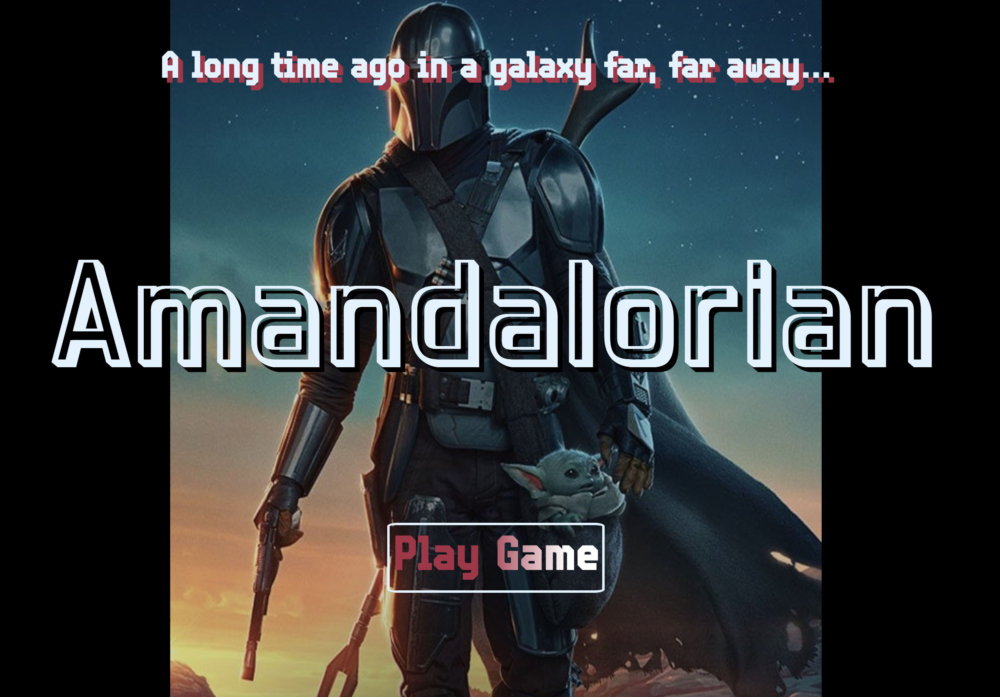

<h1>AMANDALORIAN</h1>

<h3>ABOUT THE GAME</h3>

<i>
Amandalorian is the story of a bounty hunter, who the user plays as. Starting scene sets the plot of the game, and a button appears to "Play Game". Upon clicking the "Play Game" button, the user is brought to a pub, where a story appears about their "client" asking them to find "The Asset." Not much information is provided about what "The Asset" is, only that you must begin your search for it.  Two buttons appear for where to begin the search - the first button is "The Desert" and the second button is "The Forest." Both options will bring the user to a game of chance - clicking images to find and reveal "The Asset." However, clicks are risks! The first click that does not reveal "The Asset" begins a countdown timer. Find "The Asset" before the timer is up, or the board resets and randomizes again.  A button is available near both game boards to return to the pub scene, where you can explore the pub (animation/videos will appear) through button clicks. Upon successfully finding "The Asset," a story appears about how you did not know "The Asset" was actually a child. You are then presented with two options - a button to "Deliver the Asset" to your client, or a button to "Harbor the Child" and become a fugitive.  Choose your own adventure, play a game, then choose your ending!</i>
 
 
 
LINK TO PLAY GAME HERE:
 
<a href="https://amandalorian.netlify.app/">AMANDALORIAN</a>
 
 

 
 
<h3> Technologies Used</h3>
<ul>
<li>Javascript</li>
<li>CSS</li>
<li>HTML</li>
<li>Adobe Fonts Style Sheets</li>
<li>VSCode</li>
<li>Firefox Developer Tools</li>
</ul>
 
<h3> Media Credits/Legal Disclosure </h3>
 
<h4>All media used is legal copyright of Disney. This game is for educational purposes only and is not for profit, sale or distribution. Still images are from "The Art of The Mandalorian," with concept art by Ryan Church, Christian Alzmann, Nick Gindraux, Anton Grandert, Doug Chiang and John Park.
 
 Any credit omissions are not intentional and will be updated accordingly. Please message me if any adjustments to credits should be made.
</h4>
 
 
<h3>Sources</h3>
 
<ul>
  <li>Disney for all media</li>
  <li>https://animate.style/</li>
  <li>https://developer.mozilla.org/en-US/</li>
  <li>https://stackoverflow.com</li>
  <li>General Assembly Engineering Channel</li>
  <li>King Manley the Third</li>
</ul>
 
<h4>ICE BOX ITEMS/FUTURE ENHANCEMENTS:</h4>
 
<ul>
<li>More CSS styling and animation (incorporate more ideas from pseudo-code)</li>
<li>Initial landing page with scrolling introduction</li>
<li>Improve mobile device usability and display</li>
<li>On grid clicks, change image to Jawa or Stormtrooper helmet if they are a "miss"</li>
<li>Sound effects for each grid click</li>
<li>Video incorporation</li>
<li>Enhanced storyline with more choices</li>
<i>
</ul>
 
 
Please download the .jpg file to review planning flowchart for building the Amandalorian game
  
 
 
Amandalorian Pseudo-Code

1. Create opening credits scene

 1a) Title centered on landing page, animated to move a bit, background music to Mandalorian opening
 1b) Lines of text introduce the game
 1c) Hover over title, reveals story for the plot - delayed animation for each line of the story
 1d) Story line animates from bottom of screen to top slowly and fades away (Star Wars-esque)
 1e) Play Game button with styling

2. Create "choose your adventure" page - "The Pub" scene
 
 2a) Two boxes appear after "Play Game" button is pressed, scene is in the pub
 2b) Button to produces different gif graphic from the Mandalorian series
 2c) Buttons to click "Desert" scene or "Forest" scene for where to search first

3. Create two "game" scenarios - Desert and Forest - based on scene choice from step 2

3a) On desert button click, render grid game - click images to find "The Asset"
3b) Clicks are risks! 35/36 clicks present Jawas that steal your ship parts
3c) First Jawa revealed begins a timer
3d) Must click to find "The Asset" before the timer expires (very short timer window, 7 sec)
3e) On timer expire, grid game is reset and randomizes location of "The Asset" - forces start over - Message is displayed to user about ship needing critical repairs and must begin search again
3f) Option button to return to "The Pub" scene
3g) 1/36 clicks on grid presents "The Asset" - aka, "The Child"

3h) On forest click, render grid game - click trees and bamboo shoots to find "The Asset"
3i) Clicks are risks! 35/36 clicks present Storm Trooper helmets
3j) First Storm Trooper helmet revealed begins a timer
3k) Must click to find "The Asset" before the timer expires (very short timer window, 7 sec)
3l) On timer expire, grid game is reset and randomizes location of "The Asset" - forces start over - Message is displayed to user about fighting rogue Storm Troopers who are trying to find "The Asset" and must begin search again.
3m) Option button to return to "The Pub" scene
3n) 1/36 clicks on grid presents "The Asset" - aka, "The Child"

4. If click and find "The Asset" aka, "The Child"

4a) Story scrolls up the screen in the same manner as the opening credits scene about how you did not know this 50-year old "Asset" was a child...
4b) Once story stops, two buttons appear
4c) One button is option to deliver "The Asset" to the client as agreed upon for the bounty
4d) Other button is option to harbor "The Child" and become a fugitive, evade your client
4e) Deliver "The Asset" button - on click, presents a story about sad Baby Yoda, but you're rich now
4e) Harbor "The Child" button - on click, presents a story about how you're now responsible for Baby Yoda and must find Skywalker 
</i>